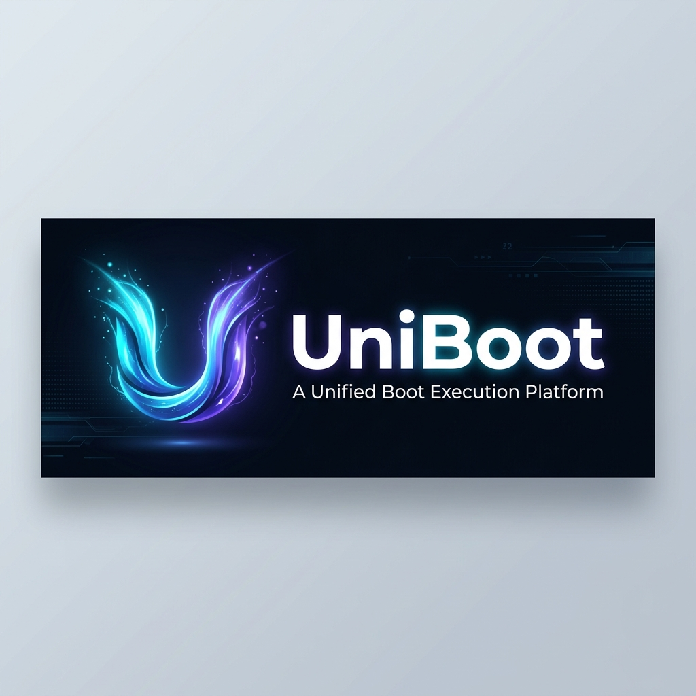

<p align="center">
  
</p>

<p align="center">
  <strong>打破边界，统一引导 —— 融合本地与云端网络的系统安装执行层</strong>
</p>

<p align="center">
  <a href="README.md">English Version</a>
</p>

UniBoot 是一个统一引导执行层（Unified Boot Execution Layer），将本地引导、网络引导与官方安装器整合为一个轻量、安全、可扩展的系统安装平台。

UniBoot 不分发任何系统镜像（ISO/WIM/DMG/IPSW）。  
所有系统内容均由官方安装器从官方镜像源下载，并直接写入目标硬盘。  
UniBoot 本身是一个执行层（Execution OS），而不是传统意义上的工具盘或系统盘。

---

## 特性

### 统一引导层

- 本地引导（Ventoy）
- 网络引导（iPXE / netboot.xyz）
- 单一菜单、统一入口
- 官方安装器统一化

### 本地引导能力

- 支持 ISO / WIM / IMG / VHD
- 自定义主题与配置
- 轻量、快速、无需系统内容

### 网络引导能力

- iPXE 加载 kernel + initrd
- 支持 HTTP(S) / TFTP / FTP / PXE
- 自动进入官方安装器

### 官方安装器

- Windows 官方安装器
- Linux 官方安装器（Debian / Ubuntu / Arch / Fedora 等）
- macOS 官方安装器（通过 Mist）
- 路由系统（OpenWrt / OPNsense 等）

UniBoot 不保存、不缓存、不分发任何系统内容。

---

## 架构

UniBoot 由三层组成：

### 1. 本地执行层

```text
/boot/       # Ventoy + iPXE
/iso/        # 用户自放 ISO（可选）
/config/     # 本地配置
```

### 2. 网络执行层

```text
/ipxe/
├── menu.ipxe
├── profiles/
├── scripts/
└── sources/
```

### 3. 后台控制层（可选）

- 动态生成 menu.ipxe
- 自动化安装脚本
- 企业镜像源管理
- 策略化部署
- 品牌与主题定制

---

## 许可协议

UniBoot 是基于 **GNU General Public License v2.0 (GPL-2.0-only)** 发布的开源软件。  
详情请查看 [LICENSE](LICENSE)。

---

## UniBoot 不是

- 不是工具盘
- 不是 PE
- 不是系统镜像
- 不包含任何 Windows / Linux / macOS / Router 系统
- 不提供盗版系统
- 不提供破解工具

UniBoot 是一个系统执行层（Execution OS）。

---

## 企业版与 SaaS 服务

UniBoot 企业版与云端服务提供：

- 私有镜像源与国内 CDN 节点加速
- 云端动态菜单 API 控制台
- 爱快 / Windows / Linux 自动化无人值守应答生成引擎
- 企业策略管理与离线部署
- 审计与日志
- 品牌与主题定制

如需商业授权或企业技术支持，请联系 SnowdreamTech Inc.（[snowdreamtech@qq.com](mailto:snowdreamtech@qq.com)）。

---

## 致敬与鸣谢（Acknowledgements & Credits）

UniBoot 站在开源巨人的肩膀上。特别致敬并感谢以下开源项目的开发者与维护团队：

- **[Ventoy](https://www.ventoy.net/)**：极其优秀的开源可引导 U 盘制作工具。Ventoy 作为 UniBoot 的本地引导执行层基础。
- **[iPXE](https://ipxe.org/)**：强大灵活的开源网络引导固件。iPXE 作为 UniBoot 网络引导与云端脚本执行的核心引擎。
- **[netboot.xyz](https://netboot.xyz/)**：深受开发者喜爱的网络操作系统引导平台。netboot.xyz 为 UniBoot 的云端网络引导生态和降级机制提供了灵感与参考。

---

## 项目状态

当前状态：开源活跃开发中（Active Open-Source Development）  
欢迎提交 Issue 和 Pull Request 参与共建！

---

## 版权声明

© 2026-present SnowdreamTech Inc. & iPXE authors. 保留所有权利。
